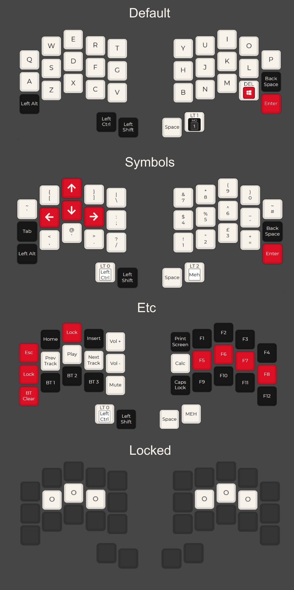

# Beetboard
config for my wireless 34 Key split keyboard
## Using
- shield: [Ferris Sweep](https://github.com/davidphilipbarr/Sweep)
- board: [nice! nano v2.0](https://nicekeyboards.com/nice-nano/)
- firmware: [ZMK](https://zmk.dev/)
- layout vis: [QMK Configurator](https://config.qmk.fm/#/ferris/sweep/LAYOUT)

